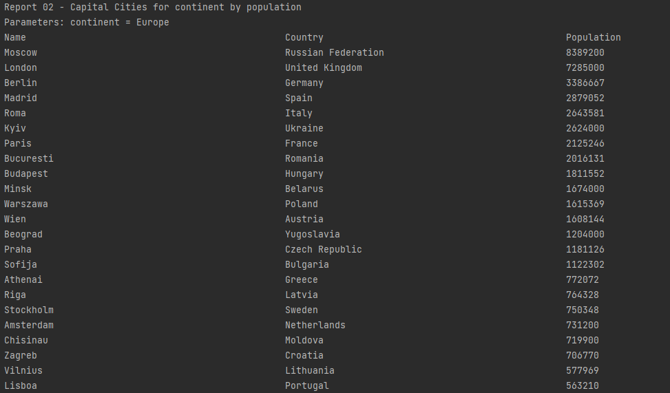
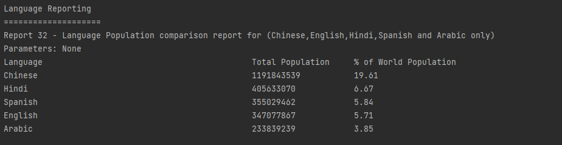

# Software Engineering Methods - Group 2 Assessment

- Developer Build Status 
- Master Build Status 
- License 
- Release 

-----
# Checklist for Code Review 1

| Task number | Description                                                                                                                                                                                                          | Done / Not Done | 
|:-----------:|----------------------------------------------------------------------------------------------------------------------------------------------------------------------------------------------------------------------|:---------------:|
|      1      | GitHub project for coursework set-up                                                                                                                                                                                 |      Done       |
|      2      | Product Backlog created.                                                                                                                                                                                             |      Done       |
|      3      | Project builds to self-contained JAR with Maven.                                                                                                                                                                     |      Done       | 
|      4      | Dockerfile for project set-up and works.                                                                                                                                                                             |      Done       | 
|      5      | GitHub Actions for project set-up and build is working using JAR, and Docker on GitHub Actions.                                                                                                                      |      Done       |
|      6      | Correct branches for GitFlow workflow created - includes  master,  develop, and  release branches. |      Done       |
|      7      | First release created on GitHub.                                                                                                                                                                                     |      Done       | 
|      8      | Code of Conduct defined.                                                                                                                                                                                             |      Done       | 
|      9      | Issues being used on GitHub.                                                                                                                                                                                         |      Done       |
|     10      | Tasks defined as user stories.                                                                                                                                                                                       |      Done       |
|     11      | Project integrated with Zube.io.                                                                                                                                                                                     |      Done       | 
|     12      | Kanban/Project Board being used.                                                                                                                                                                                     |      Done       | 
|     13      | Sprint Boards being used.                                                                                                                                                                                            |      Done       |
|     14      | Full use cases defined.                                                                                                                                                                                              |      Done       |
|     15      | Use case diagram created.                                                                                                                                                                                            |      Done       | 

The Kanban/Project Board can be accessed from [this link.](https://zube.io/napier-253/project-board/w/workspace-1/kanban)
---
# Queries for Code Review 2
**Please note these are only snapshots. Some queries were too big to capture all results in the screenshots**

| ID  | Name                                                                                                        | Met | Screenshot                                           |
|-----|-------------------------------------------------------------------------------------------------------------|-----|------------------------------------------------------|
| 1   | All the countries in the world organised by largest population to smallest                                  | Yes |              |
| 2   | All the countries in a continent organised by largest population to smallest                                | Yes |              |
| 3   | All the countries in a region organised by largest population to smallest                                   | Yes |                 |
| 4   | The top 'N' populated countries in the world where N is provided by the user                                | No  | put your image here                                  |
| 5   | The top 'N' populated countries in a continent where N is provided by the user                              | No  | put your image here                                  |
| 6   | The top 'N' populated countries in a region where N is provided by the user                                 | Yes |             |
| 7   | All the cities in the world organised by largest population to smallest                                     | Yes |                 |
| 8   | All the cities in a continent organised by largest population to smallest                                   | Yes |     |
| 9   | All the cities in a region organised by largest population to smallest                                      | Yes |        |
| 10  | All the cities in a country organised by largest population to smallest                                     | Yes |       |
| 11  | All the cities in a district organised by largest population to smallest                                    | Yes |      |
| 12  | The top 'N' populated cities in the world where N is provided by the user                                   | No  | put your image here                                  |
| 13  | The top 'N' populated cities in a continent where N is provided by the user                                 | No  | put your image here                                  |
| 14  | The top 'N' populated cities in a region where N is provided by the user                                    | No  | put your image here                                  |
| 15  | The top 'N' populated cities in a country where N is provided by the user                                   | No  | put your image here                                  |
| 16  | The top 'N' populated cities in a district where N is provided by the user                                  | Yes |  |
| 17  | All the capital cities in the world organised by largest population to smallest                             | Yes |          |
| 18  | All the capital cities in a continent organised by largest population to smallest                           | Yes |    |
| 19  | All the capital cities in a region organised by largest to smallest                                         | No  | put your image here                                  |
| 20  | The top 'N' populated capital cities in the world where N is provided by the user                           | Yes |        |
| 21  | The top 'N' populated capital cities in a continent where N is provided by the user                         | Yes |      |
| 22  | The top 'N' populated capital cities in a region where N is provided by the user                            | No  | put your image here                                  |
| 23  | The population of people, people living in cities, and people not living in cities in each continent        | No  | put your image here                                  |
| 24  | The population of people, people living in cities, and people not living in cities in each region           | No  | put your image here                                  |
| 25  | The population of people, people living in cities, and people not living in cities in each country          | No  | put your image here                                  |
| 26  | The population of the world                                                                                 | No  | put your image here                                  |
| 27  | The population of a continent                                                                               | No  | put your image here                                  |
| 28  | The population of a region                                                                                  | No  | put your image here                                  |
| 29  | The population of a country                                                                                 | Yes |               |
| 30  | The population of a district                                                                                | No  | put your image here                                  |
| 31  | The population of a city                                                                                    | No  | put your image here                                  |
| 32  | The number of people who speak Chinese, English, Hindi, Spanish and Arabic from greatest number to smallest | Yes |               |
